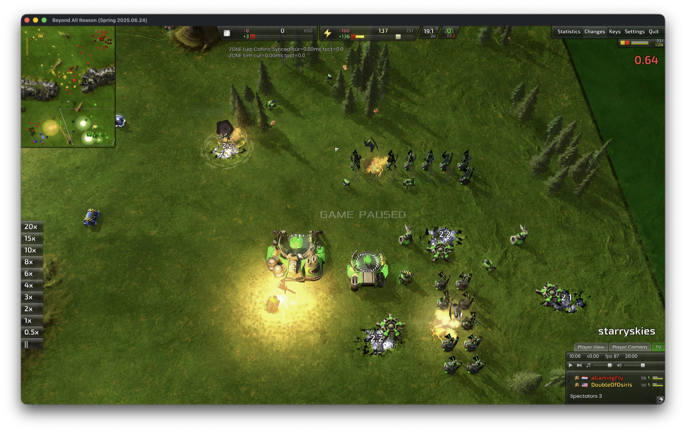
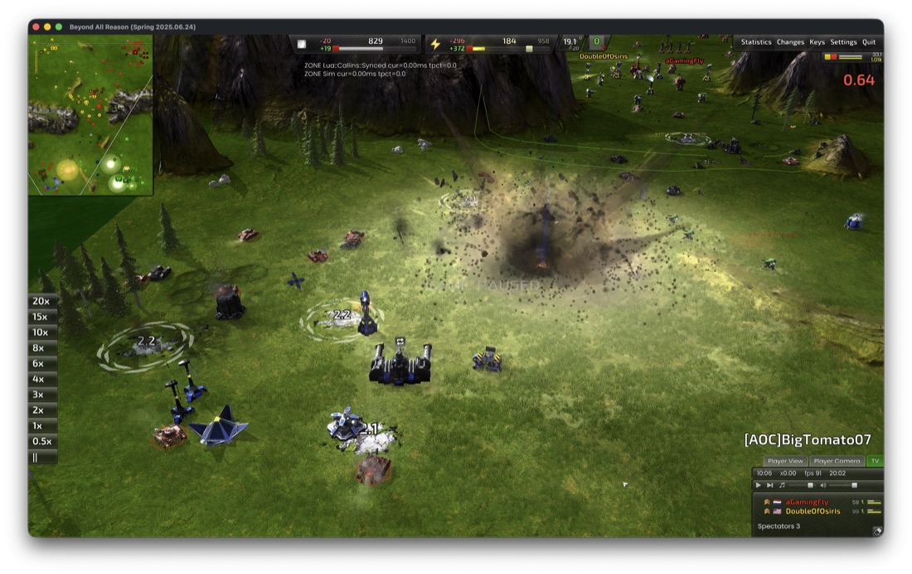
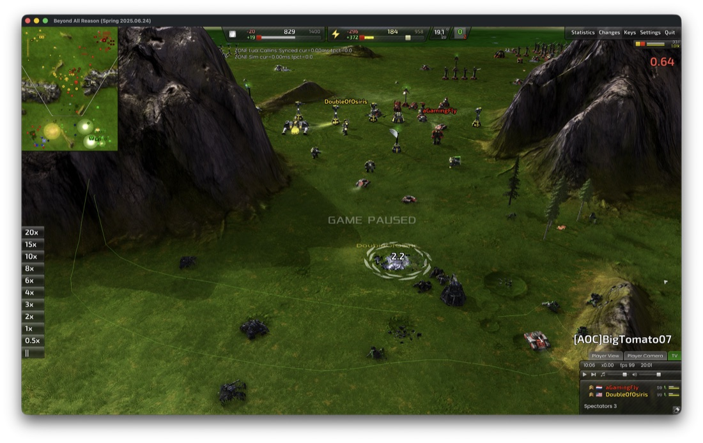

# recoil-apple — the Recoil engine, native on macOS (Apple Silicon)

<p align="center">
  <a href="https://github.com/benbreen/recoil-apple/releases/latest"></a>
  
  <a href="https://github.com/benbreen/recoil-apple/releases"></a>
  
  
</p>

**This project is a native Apple Silicon port of the
[Recoil](https://github.com/beyond-all-reason/RecoilEngine) RTS engine** — the
engine itself, running on macOS with no Rosetta and no virtual machine. It is
not a game: it is the platform that Recoil/Spring games run on.

For convenience, releases also include an **optional BAR launcher package**: a
drag-to-install app that (with your explicit consent, and with the caveats
below) downloads **[Beyond All Reason](https://www.beyondallreason.info/)**
from its official content network and configures the engine to play it — full
graphics, full online multiplayer against Windows and Linux players in the
same lobbies.

**Two downloads** on the [releases page](https://github.com/benbreen/recoil-apple/releases/latest):

| Artifact | What it is | For whom |
|---|---|---|
| `Recoil-macos-<engine>-port<ver>.zip` | **The project itself** — the engine port: signed, notarized `spring`, `spring-headless`, and `pr-downloader` with the bundled Metal driver stack. No game content or configuration. | Any Recoil/Spring game community, tooling, or anyone building their own game launcher on top. |
| `BAR-macos-<ver>.dmg` | **Convenience package** — the engine plus a BAR launcher: a drag-to-install app that (after an explicit consent prompt) downloads Beyond All Reason from BAR's official content network, keeps it updated, and launches straight into its lobby. | Players who want to play BAR on a Mac. |

> [!CAUTION]
> **Unofficial project — third-party game content.** This is an independent
> community port, not affiliated with, endorsed by, or supported by the Recoil
> engine team or the Beyond All Reason project. **No game content is hosted
> here**: this repository and its releases contain only the engine (GPL-2.0)
> and this port's packaging. The game itself — **including executable game
> code that the engine runs**, plus its units, art, sounds, and maps,
> under [BAR's own licenses](https://github.com/beyond-all-reason/Beyond-All-Reason/blob/master/LICENSE.md)
> — is downloaded by the helper app from BAR's official content network on
> first launch (after an explicit consent prompt) and may auto-update later,
> possibly including other components in future.
> That code and content is not hosted, vetted, or endorsed by this project's
> maintainer, who accepts no responsibility for it or for any damage it may
> cause — install and play **AT YOUR OWN RISK**. Downloads use HTTPS and
> content-hash verification (integrity in transit, not a vetting of the
> content). If you believe game content is malicious, report it to the
> [BAR project](https://github.com/beyond-all-reason/Beyond-All-Reason);
> report problems with this port **here**, not to them.

> **Good faith, stated up front.** This project is free, unofficial, and
> takes no money — no donations, no sponsorships. If the Beyond All Reason or
> Recoil projects object to any part of it, including the names used, it will
> be renamed or taken down on request. Support is best-effort. Download only
> from this repository's [Releases](../../releases) page and verify the
> published SHA-256 checksums; no other distribution channel is ours. Security
> issues: see [SECURITY.md](SECURITY.md).

> ⚡️ **A Claude Fable port.** The macOS layer in this repository was built
> largely by **[Claude Fable](https://www.anthropic.com)** (Anthropic's Claude
> model), on top of ExaDev's foundational macOS work — see
> [What this project did](#what-this-project-did).

<p align="center">
  <a href="https://github.com/benbreen/recoil-apple/releases/latest"><b>⬇&nbsp; Download for macOS (Apple Silicon)</b></a>
  &nbsp;·&nbsp; engine port + optional BAR launcher &nbsp;·&nbsp; macOS 26+
</p>

<p align="center">
  
  <br><em>The engine port running Beyond All Reason natively on an Apple Silicon Mac.</em>
</p>

The [Recoil engine](https://github.com/beyond-all-reason/RecoilEngine) is the
program that actually runs a game built on it: the simulation, graphics, and
networking. The engine ships for Windows and Linux; this repository is a
native macOS build of it. Under the hood it renders through Apple's Metal
(OpenGL 4.6 → Mesa Zink → [KosmicKrisp](https://lunarg.com/kosmickrisp/) →
Metal) and simulates bit-identically to the official builds, so a Mac client
shares the same matches and replays as everyone else. Pinned to engine
version **2025.06.24**, the version BAR's live fleet runs; the screenshots
and benchmarks throughout show the engine port running Beyond All Reason.

## What this project did

The macOS *foundation* — the first working Apple Silicon builds, the
surfaceless-EGL → Zink graphics path, and the ARM64 deterministic-math
groundwork now
[merged into the official engine](https://github.com/beyond-all-reason/RecoilEngine/pull/2819)
— comes from [ExaDev's macOS fork](https://github.com/ExaDev/RecoilEngine), whose
commits keep their authorship here (full [Credits](#credits) below).

That foundation ran the game on a Mac, but it did **not** yet produce a
*compliant* engine — one that can join public multiplayer without desyncing.
BAR is lockstep-deterministic: every client recomputes the entire simulation
and must get **bit-identical** results, and an Apple Silicon client still
diverged from the x86 fleet in three ways:

1. **A different math library.** Apple's libm returns per-ULP-different
   results for `double` functions than the glibc implementations the fleet's
   builds use — any one call in synced code is a desync.
2. **Undefined float→integer conversions.** Out-of-range float→int is
   undefined behavior; the fleet's gcc-x86 binaries saturate in hardware
   (`cvttss2si`) and game unit scripts rely on that value, while clang-arm64
   computed something else (the cause of a real desync in Raptors games).
3. **Fused multiply-adds.** On ARM the compiler freely contracts `a*b+c` into
   one `fmadd` with different rounding — a single contraction in synced code
   is a 1-ULP, game-ending divergence.

This repository is the layer that closed those gaps and **proved** the result,
developed largely by **Claude Fable** (Anthropic's Claude model) with direction
from the maintainer — not a thin wrapper:

- **Bit-exact cross-architecture simulation** — the core of the port: the
  glibc dbl-64 libm compiled in for fleet-parity `double` math (guarded by a
  9/9 libm hash gate in every build), x86 conversion semantics reproduced on
  arm64, `-ffp-contract=off` enforced globally, and a UB sweep of synced code
  — then certified bit-exact over full-length 8v8 replays and live
  cross-platform matches ([SYNC_VALIDATION.md](SYNC_VALIDATION.md); the
  complete register of synced-code changes is its Appendix A).
- **A rebuilt macOS graphics-present path.** The EGL/Metal context and the whole
  read-back-and-present pipeline were extracted into a proper `Platform/Mac`
  backend, and the driver stalls and bugs that made the earlier path unshippable
  were fixed.
- **A one-command, reproducible build-and-release pipeline.** `make app` builds
  the graphics driver from pinned upstream source, builds the engine, runs the
  determinism gates, and produces the signed, notarized, drag-to-install
  `.app`/`.dmg` — nothing fetched or built by hand ([details below](#building-the-macos-app)).
- **A month-one performance campaign** taking heavy late-game scenes from
  single-digit frame rates to display-class ones at 5K, pixel-identical (table
  below).
- **Native-Mac behaviour** — correct window title, Cmd-based clipboard, a Cmd+Q
  guard so a reflex keystroke can't abandon a live match, Local-Network
  permission handling, and loud failure instead of a silent slow software
  fallback.

Upstream's own engine README is
[README-upstream.markdown](README-upstream.markdown); this file covers the macOS
build.

## What works

- **Full game, online-compatible simulation.** The port is sync-certified
  against official builds: bit-exact lockstep over full-length 8v8 replays
  (up to 92,040 frames) and live LAN games versus unmodified official Linux
  and Windows release binaries, including 16-player games and PvE modes,
  with zero sync errors. Method, numbers, reproduction commands, and honest
  limits: **[SYNC_VALIDATION.md](SYNC_VALIDATION.md)**.

  > **Online multiplayer is disabled in the released build** while approval to
  > connect to Beyond All Reason's community servers is sought from the game's
  > creators. Skirmish vs AI, replays, and local-network (LAN) games work; the
  > online lobby opens on a sign-in screen you dismiss with **Cancel**. The sim
  > is online-*capable* and certified above — the block is a deliberate policy
  > choice in the launcher, not a technical limit. Builds from source can
  > enable it (see "Building the macOS app").
- **Native performance.** A month-one optimization campaign took the heavy
  late-game scenes from single-digit to display-class frame rates at 5K with
  pixel-identical output (measured on an M2 Ultra Mac Studio, vsync on):

  | Scene | Before | After |
  |---|---|---|
  | 2,162-unit battle arena | 6.8 fps | 54.4 fps (8.0×) |
  | 1,082-unit battle, combat zoom | 12.1 fps | 71.7 fps (5.9×) |
  | Late-game 8v8, icon overview | 4.7 fps | 45.5 fps (9.7×) |
  | Early game | 50.6 fps | display-limited (120 Hz) |

  What changed and why, with the methodology:
  **[IMPROVEMENTS.md](IMPROVEMENTS.md)**.
- Retina/HiDPI, dynamic window resize, borderless fullscreen, lobby
  (Chobby) networking, music/effects via openal-soft, P/E-core-aware
  threading.

## Screenshots

<p align="center">
  
  
  <br><em>Real matches, full interface — captured on macOS. (More in the game itself.)</em>
</p>

## Requirements

- Apple Silicon Mac (developed/benchmarked on M2 Ultra; the graphics work
  targets Apple's TBDR GPUs generally).
- macOS 26+ (KosmicKrisp needs Metal 4).
- Game content downloads from the official BAR content network on first run
  (not bundled; served by the BAR project's infrastructure).

## Known limitations (honest ones)

- Late-game 8v8 frame rate is bounded ~60–70 fps by single-threaded
  simulation + game-Lua on the main thread — an upstream engine property,
  not a graphics-stack limit on this port.
- Memory footprint is healthy on desktop (≈7.4 GB RSS in late-game 8v8) but
  heavy for smaller devices.
- Geometry shaders are unavailable (Metal has no geometry stage); BAR does
  not require them.

## Building / stack

The GL stack is upstream Mesa (Zink + KosmicKrisp) at a pinned commit plus
a small patch series maintained both as a Mesa fork branch and as plain
`patches/mesa/*.patch` — the driver is reproducible from pure upstream
source. Engine-side macOS work is a curated, reviewable commit series on
top of the upstream release tag, written to be upstreamable piecewise.

## Building the macOS app

Everything needed ships in this repository — the engine source, the Mesa
patch series (`patches/mesa/`), the driver/engine build scripts
(`scripts/`), and the packaging pipeline (`packaging/`, `Makefile`).

Prerequisites: an Apple Silicon Mac on macOS 26+, Xcode Command Line Tools,
and [Homebrew](https://brew.sh) — the build installs the packages it needs
(SDL2, LLVM 19 for the driver compile, openal-soft, …) as it goes.

```sh
make app         # the BAR launcher package: pinned Mesa driver (cached
                 # after the first build) -> engine + determinism gates ->
                 # BAR Launcher.app + .dmg (ad-hoc signed, local use)
make engine-dist # the Recoil engine alone (no BAR helper/branding):
                 # Recoil-macos-<engine>-port<ver>.zip
make certify     # app + full replay-determinism certification (GPU, ~1h)
make release     # certified + Developer ID signed + notarized (needs
                 #   IDENTITY="Developer ID Application: ..." and
                 #   NOTARY_PROFILE=<notarytool keychain profile>)
make engine      # just the engine binary, with the sync gates
```

**Online play is disabled by default.** Released builds ship with the online
lobby server neutralized (it resolves to an unreachable host) while approval
to connect to BAR's community servers is sought from the game's creators — LAN
and local play are unaffected. To build a copy with online enabled for your
own testing, pass `ONLINE=1` (e.g. `ONLINE=1 make app`) or
`packaging/release-build.sh --enable-online`. Please do not distribute
online-enabled builds until that approval is in place.

What the build does, in order: builds the Mesa Zink+KosmicKrisp driver from
the pinned upstream commit + `patches/mesa/` (provenance-stamped, skipped
when already built); builds the engine against it with the deterministic-FP
configuration; runs the libm fleet-parity hash gate and the cross-arch
streflop sync-test; stages, signs, and (for `make release`) notarizes the
bundle with the styled drag-to-install DMG. Heavier validation (full-replay
determinism, GPU driver-identity smoke) is the certify tier — mirroring
upstream Recoil CI, where build and validation are separate workflows.

## Runtime knobs

One policy: **user-facing switches are registered springsettings config
variables** (discoverable, documented, changeable from the game); **env vars
are support/debug escape hatches**, and anything heavier is compiled out of
release builds behind `-DSPRING_MAC_DIAGNOSTICS=ON`.

Config (springsettings.cfg):

| Key | Default | Meaning |
|---|---|---|
| `MacPresentDirect` | 1 | Present shader reads the readback ring directly from unified memory; 0 = IOSurface staging path. Runtime-changeable. |
| `MacWorkerQos` | 1 | Sync-pool ThreadPool workers request USER_INITIATED QoS (prefer the performance cluster). Runtime-changeable. |
| `WindowTitle` | "" | Window title; `{version}` expands to the engine version. Empty = engine default. |

Environment (support escape hatches; all default off/unset):

| Var | Effect |
|---|---|
| `SPRING_MAC_NO_RETINA=1` | Render at logical 1x and let CoreAnimation upscale (readback cost /4 on Retina). |
| `SPRING_MAC_GL_CORE=1` | Force a core-profile GL context (compat is the default and the supported mode). |
| `SPRING_MAC_LEGACY_PRESENT=1` | CPU-staging present path (the pre-optimization fallback). |
| `SPRING_ALLOW_SOFTWARE_GL=1` | Permit the llvmpipe/softpipe fallback instead of failing loudly. |
| `SPRING_EGL_FULL_TEARDOWN=1` | Real EGL teardown at exit (debug the driver shutdown race; default is fast-exit). |
| `SPRING_NO_STALL_LOG=1` | Silence the >150ms draw-gap stall log lines. |
| `SPRING_MAC_STREAM_BUFFERING=n` | Stream-buffer ring depth 2..8 (default 3). |
| `SPRING_LUAVAO_FORCE_RESTART=1` | Restore upstream primitive-restart behavior on list topologies. |
| `KK_MATH_MODE=safe\|relaxed\|fast` | KosmicKrisp shader-compiler math mode (engine defaults it to `fast`). |
| `SPRING_DUMP_STATE_RANGE=min:max` | Dump full synced state per frame in the range (desync triage; local analysis only). |

Diagnostics builds only (`cmake -DSPRING_MAC_DIAGNOSTICS=ON`; not compiled
into releases): `SPRING_MAC_PRESENT_TEST`, `SPRING_FRAME_CAPTURE[_EVERY/_LIMIT]`,
`SPRING_MAC_DUMP_FRAME`, `SPRING_TIME_PRESENT`, `SPRING_MAC_PRESENT_LAG`,
`SPRING_MAC_PRESENT_GPUPACK`.

## Documentation

Deeper docs live alongside the code — start with **AGENTS.md** if you want to
work on the port (with or without an AI agent).

| Document | What it is |
|---|---|
| [AGENTS.md](AGENTS.md) | Start here to work on the port: read-order, the hard rules, and how to build. Written so an AI coding agent can get up and running. |
| [docs/PORTING_PRINCIPLES.md](docs/PORTING_PRINCIPLES.md) | The golden rules — the determinism contract, sim untouchability, per-subsystem strategy, and the verification ladder. |
| [SYNC_VALIDATION.md](SYNC_VALIDATION.md) | How multiplayer bit-exactness is proven: method, numbers, reproduction commands, and honest limits. |
| [IMPROVEMENTS.md](IMPROVEMENTS.md) | What the port changes and why — each entry symptom → cause → fix → measured result. |
| [docs/MAINTENANCE.md](docs/MAINTENANCE.md) | How the macOS layer rides upstream: the version-bump / rebase-onto-a-new-release procedure. |
| [docs/AGENT_FAILURE_MODES.md](docs/AGENT_FAILURE_MODES.md) | What halts or silently misleads an automated agent on macOS (dialogs, permissions, fallbacks). |
| [docs/LESSONS.md](docs/LESSONS.md) | Numbered, citable gotchas already hit during the port. |
| [docs/UPSTREAM_CANDIDATES.md](docs/UPSTREAM_CANDIDATES.md) | Fixes in this layer that belong upstream, so the patch series shrinks over time. |
| [docs/VERSIONS.md](docs/VERSIONS.md) | Pinned versions (engine, driver, toolchain) and why each is pinned. |
| [docs/SOUND_WARNINGS_CATALOG.md](docs/SOUND_WARNINGS_CATALOG.md) | Reference for the audio-subsystem warnings you may see in the log. |

## Credits

This port stands on a lot of prior work, gratefully:

- **[ExaDev](https://github.com/ExaDev/RecoilEngine)** — the foundational
  macOS fork: first working builds, EGL/Zink bring-up, pr-downloader fixes.
  Their commits form the base of this series, preserved with attribution.
- **The Recoil engine team** — especially the ARM64 deterministic
  floating-point work merged in
  [PR #2819](https://github.com/beyond-all-reason/RecoilEngine/pull/2819),
  without which cross-platform lockstep on Apple Silicon would not exist.
- **The Beyond All Reason project** — the game, the content network, and
  the reason any of this is worth doing.
- **Mesa / Zink** and **KosmicKrisp** (LunarG, Google) — the driver stack
  that makes GL 4.6 compatibility profile on Metal real.
- **SDL2, openal-soft, streflop**, and the rest of the dependency tree.
- Porting methodology informed by the
  [C&C Generals Apple port](https://github.com/ammaarreshi/Generals-Mac-iOS-iPad)
  (built on [GeneralsX](https://github.com/fbraz3/GeneralsX)).

## License

**GPL-2.0-or-later**, same as the upstream Recoil engine — full text in
[LICENSE](LICENSE). Bundled components keep their own compatible licenses
(streflop/vendored libm under LGPL, the SDL/OpenAL/Mesa stack under MIT/BSD/zlib
— see [COPYING](COPYING) and the component directories). Complete corresponding
source for every shipped binary is this repository plus the pinned/patched
dependency set documented in the release notes.

Beyond All Reason's game content (units, art, sounds, music, maps) is **not
part of this repository or its releases** and is licensed separately by the
BAR project ([their LICENSE.md](https://github.com/beyond-all-reason/Beyond-All-Reason/blob/master/LICENSE.md)
— GPL-2.0 for game code; most art under CC-BY-NC-ND-4.0 and other restricted
terms). The app downloads it from BAR's official content network at first
launch.

## Reporting issues

This is an unofficial port: please report problems **on this repository's
issue tracker**, not to the Recoil or BAR projects — a bug here is most likely
this port's fault, and their trackers shouldn't carry our noise.

Open a GitHub issue with your `infolog.txt` (it includes the one-line
driver-identity print so we can see which GL stack actually loaded). For
anything that looks like a sync/desync problem, please say so in the title —
those get priority and a documented triage path (see SYNC_VALIDATION.md §5).
